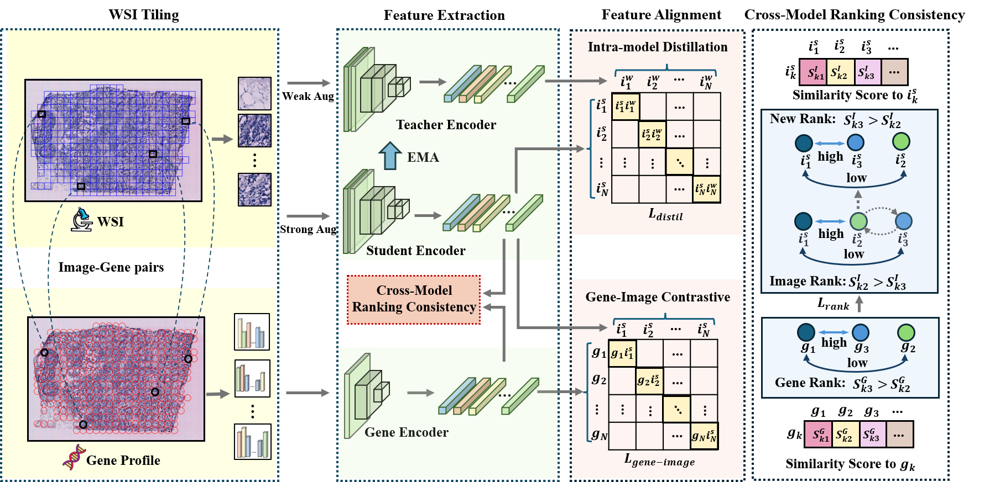

<div align="center">
<h1> RankByGene: Gene-Guided Histopathology Representation Learning Through Cross-Modal Ranking Consistency </h1>

[Wentao Huang](https://winston52.github.io/)<sup>1</sup>, [Meilong Xu](https://melon-xu.github.io/)<sup>1</sup>, [Xiaoling Hu](https://huxiaoling.github.io/)<sup>2</sup>, [Shahira Abousamra](https://shahiraabousamra.github.io/)<sup>3</sup>, [Aniruddha Ganguly](https://scholar.google.com/citations?user=T1UcV2gAAAAJ&hl=en)<sup>1</sup>, [Saarthak Kapse](https://saarthak-kapse.github.io/)<sup>1</sup>, [Alisa Yurovsky](https://ayurovsky.github.io/)<sup>1</sup>, [Prateek Prasanna](https://you.stonybrook.edu/imaginelab/)<sup>1</sup>, [Tahsin Kurc](https://bmi.stonybrookmedicine.edu/people/tahsin_kurc)<sup>1</sup>, [Joel Saltz](https://bmi.stonybrookmedicine.edu/people/joel_saltz)<sup>1</sup>, [Michael L. Miller](https://scholar.google.com/citations?user=7EVp2IkAAAAJ&hl=en)<sup>4</sup>, [Chao Chen](https://chaochen.github.io/)<sup>1</sup>

<sup>1</sup> Stony Brook University &nbsp;&nbsp; <sup>2</sup> Harvard Medical School &nbsp;&nbsp; <sup>3</sup> Stanford University &nbsp;&nbsp; <sup>4</sup> Columbia University

[](https://github.com/winston52/RankByGene)
[](https://opensource.org/licenses/MIT)
</div>

## 📖 Introduction

**RankByGene** learns gene-informed histopathology image representations by aligning image and gene features through a **cross-modal ranking-consistency loss** that preserves the relative ordering of pairwise similarities across modalities, together with an **intra-modal teacher–student distillation** that stabilizes the image-branch representation. The learned features improve downstream gene expression prediction, slide-level classification, and survival analysis.

<p align="center">
  
</p>

## 🔥 Recent Updates

- **2026/06/21**: Released the gene expression prediction (downstream) code.
- **2026/06/20**: Released the gene–image alignment training and feature extraction code.
- **2026/06/19**: Released the data preprocessing code.

## 🛠️ Install

```bash
git clone https://github.com/winston52/RankByGene.git
cd RankByGene
conda create -n rankbygene python=3.8 -y
conda activate rankbygene
pip install -r requirements.txt
```

## 🚀 Step-by-Step Tutorial

### 1. Dataset Preprocessing

We use the publicly available [**HEST-1k**](https://github.com/mahmoodlab/HEST) dataset for spatial transcriptomics, and TCGA / BCNB cohorts for downstream classification and survival analysis.

After downloading the raw HEST-1k data (per-slide `.h5ad` expression and ST-patch `.h5` files), run the preprocessing script `data_preprocessing/preprocess_hest.py`, which:

- converts each `.h5ad` slide to an expression CSV and a spotfile
- extracts per-spot PNG patches
- subsets the expression to the survival gene list and applies 8-neighborhood smoothing

to produce the per-spot expression for training.

```bash
python data_preprocessing/preprocess_hest.py \
    --raw_h5ad        ./data/HEST/Breast/ST-expression-raw \
    --raw_patches     ./data/HEST/Breast/ST-patches-original \
    --expr_out        ./data/HEST/Breast/ST-expression-original \
    --spot_out        ./data/HEST/Breast/ST-spotfiles \
    --patch_out       ./data/HEST/Breast/ST-patches \
    --panel_genes_csv data_preprocessing/genelist/breast_survival.csv \
    --panel_expr_out  ./data/HEST/Breast/ST-expression/survival/8n \
    --smoothing 8n
```

The survival gene list is derived from the [Human Protein Atlas](https://www.proteinatlas.org/). The gene lists used in our experiments are provided under `data_preprocessing/genelist/` (`breast_survival.csv`, `lung_survival.csv`).

### 2. Training

Train the gene-guided image encoder with `train.py`, which optimizes the cross-modal ranking-consistency loss together with the gene–image contrastive loss and the intra-modal teacher–student distillation:

```bash
python train.py --config configs/breast_rankinfots_survival.yaml
```

Before training, set the following fields in `configs/*.yaml`:

- `MODEL.pretrained_model_path` (UNI backbone weights)
- `DATASET.train_dataset_path` (preprocessed dataset root)
- `DATASET.gene_path` (per-spot gene-list expression)
- `EXPERIMENT_DIR` (output directory)

Checkpoints are saved every 5 epochs. Configs for both datasets are provided: `configs/breast_rankinfots_survival.yaml` and `configs/lung_rankinfots_survival.yaml`.

### 3. Feature Extraction

`feature_extraction.py` extracts the teacher-branch image features (1024-dim) from a trained checkpoint. It has two modes.

**(a) Gene-prediction features** (`--mode gene`)

Pairs each spot patch with its gene expression and writes one CSV per slide, the layout consumed by `gene_prediction.py`. Run it once per split (e.g. `train` and the held-out `test`):

```bash
# training split
python feature_extraction.py --mode gene \
    --dataset_name breast \
    --patch_path ./data/HEST/Breast/ST-patches \
    --gene_path  ./data/HEST/Breast/ST-expression/survival/8n \
    --checkpoint path/to/encoder \
    --feature_save_dir ./features --model_name rankbygene \
    --split_name train

# test split
python feature_extraction.py --mode gene \
    --dataset_name breast \
    --patch_path ./data/HEST/Breast/test/ST-patches \
    --gene_path  ./data/HEST/Breast/test/ST-expression/survival/8n \
    --checkpoint path/to/encoder \
    --feature_save_dir ./features --model_name rankbygene \
    --split_name test
```

**(b) Whole-slide features for MIL** (`--mode patch`)

Extract features for every patch of a whole-slide image and write one `.h5` per WSI (`features` [N, 1024], `patch_ids` [N], and `coords` [N, 2] when patches are named `x_y`). Both `.png` and `.jpeg` patches are supported.

`--patch_dir` points to a directory of pre-tiled patches. It may be a single WSI folder, or a parent directory holding one sub-folder of patches per WSI; one `<wsi_id>.h5` is written per WSI. The expected layout:

```
path/to/patch/
├── WSI_1/
│   ├── 0_0.png
│   ├── 0_1.png
│   └── ...
├── WSI_2/
│   ├── 0_0.png
│   └── ...
└── ...
```

```bash
python feature_extraction.py --mode patch \
    --patch_dir path/to/patch \
    --checkpoint path/to/encoder \
    --output_dir ./features_h5
```

**Extract feature for a single patch**

```python
import torch
from PIL import Image
from feature_extraction import get_encoder, get_transform, extract_features

encoder = get_encoder("path/to/encoder").cuda().eval()
transform = get_transform()

image = Image.open("patch.png").convert("RGB")
image = transform(image).unsqueeze(0).cuda()        # [1, 3, 224, 224]
with torch.inference_mode():
    feature_emb = extract_features(encoder, image)   # [1, 1024]
```

### 4. Gene Expression Prediction

Using the features extracted above, train a lightweight MLP to predict per-spot gene expression with `gene_prediction.py`. The model is trained on the training-slide features with `--n_splits`-fold cross-validation and evaluated on the held-out external test split, reporting MAE, MSE, and Pearson correlation (PCC):

```bash
python gene_prediction.py \
    --train_dataset_name breast --test_dataset_name breast \
    --train_gene_path ./data/HEST/Breast/ST-expression/survival/8n \
    --test_gene_path  ./data/HEST/Breast/test/ST-expression/survival/8n \
    --feature_save_dir ./features --model_name rankbygene \
    --test_split_name test \
    --input_dim 1024 --hidden_dim 1024 --output_dim 447 \
    --epochs 20 --dropout_prob 0.2 --seed 1 --n_splits 5 \
    --output_path ./predictions
```

- `--feature_save_dir`, `--model_name`, and `--test_split_name` must match the feature extraction step; features are read from `<feature_save_dir>/<model_name>/{train,<test_split_name>}/`
- `--output_dim` is the number of genes in the gene list (e.g. 447 for the breast survival list)
- the per-fold and averaged MAE / MSE / PCC are written to `cv_summary.csv` under `--output_path`

## 🤝 Acknowledgments

Our work builds upon and is grateful to the following projects: [HEST-1k](https://github.com/mahmoodlab/HEST), [UNI](https://github.com/mahmoodlab/UNI), [BLEEP](https://github.com/bowang-lab/BLEEP), and [Human Protein Atlas](https://www.proteinatlas.org/).

## ✏️ Reference

<!-- TODO: citation to be added -->
```bibtex
@article{rankbygene,
  title   = {RankByGene: Gene-Guided Histopathology Representation Learning Through Cross-Modal Ranking Consistency},
  author  = {Huang, Wentao and others},
  year    = {2026}
}
```
